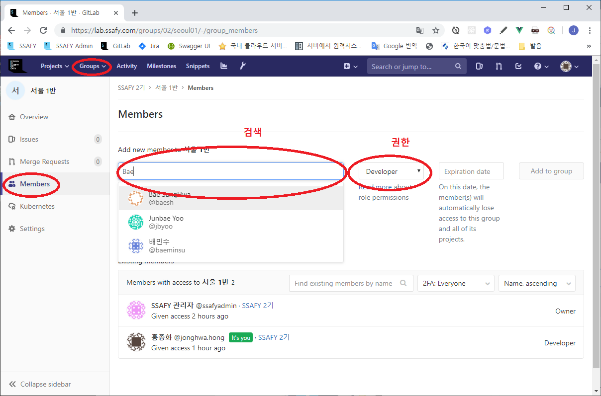
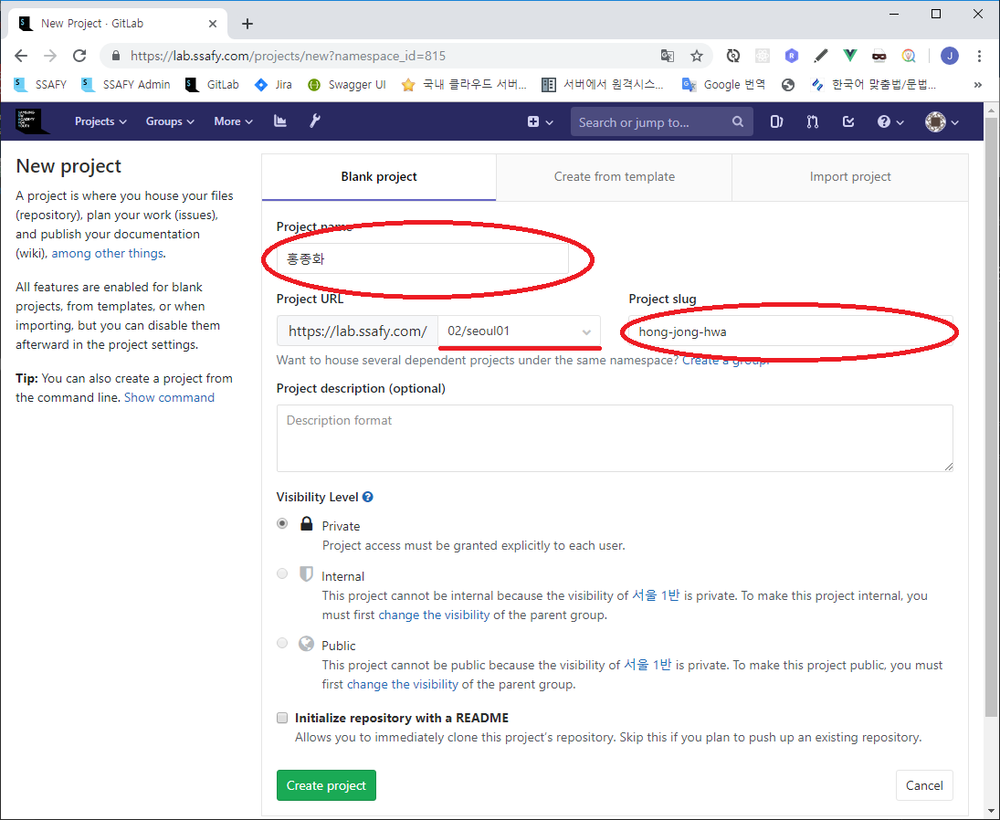
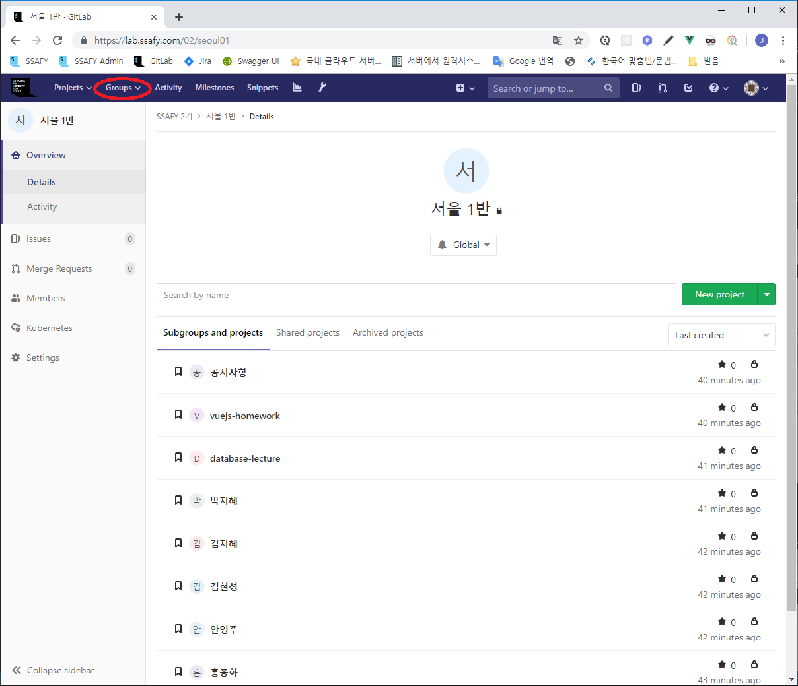

# GitLab 1학기 활용 가이드 (작업중)

### 권장 사항
1.  반 별 Private Group을 생성하여 반 멤버들 간의 자료 공유
2.  강의 자료 등 공유시 Git을 통해 공유 (공유폴더, USB 사용 등을 지양)
3.  반 별 Group 내에 Project를 생성하여 실습 과제 등을 제출하도록 유도

### 준비 단계
1. [사무국] 해당 반 별 Group 생성 후 관리자(Owner)로 각 반 교수님들께 이양
    - 예) 2기 서울 1반 https://lab.ssafy.com/02/seoul01

2. [교수] 학생들 각자에게 Git 계정 생성 안내
    - https://lab.ssafy.com/users/sign_in

3. [교수] 생성한 학생 계정을 반 별 Group 의 Member 로 등록
    - 계정 생성시 Developer 권한 부여
   

4. [학생] 반 Group에 개인 Project 생성
    - Project Name : 학생 실명 기준
    - Project Slung : 영문 이름 (각 이름 사이에 하이픈 사용)
   

### 사용예
   

